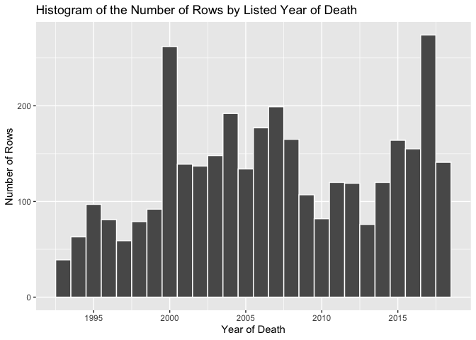
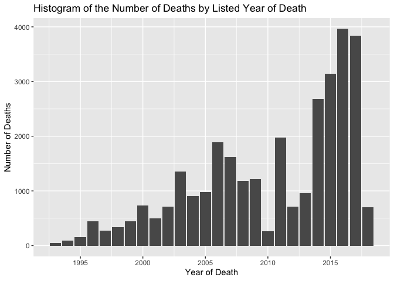

<!-- README.md is generated from README.Rmd. Please edit that file -->

# RefugeesMigrants

<!-- badges: start -->


<!-- badges: end -->

The goal of RefugeesMigrants is to learn more about the deaths of
refugees and migrants trying to come to Europe.

``` r
data("RefugeesMigrants")
library(tidyverse)
#> ── Attaching packages ─────────────────────────────────────── tidyverse 1.3.0 ──
#> ✓ ggplot2 3.3.2     ✓ purrr   0.3.4
#> ✓ tibble  3.0.4     ✓ dplyr   1.0.2
#> ✓ tidyr   1.1.2     ✓ stringr 1.4.0
#> ✓ readr   1.4.0     ✓ forcats 0.5.0
#> ── Conflicts ────────────────────────────────────────── tidyverse_conflicts() ──
#> x dplyr::filter() masks stats::filter()
#> x dplyr::lag()    masks stats::lag()
sorted<- RefugeesMigrants %>% 
  arrange(-number) %>%
  select(date_found_dead, number,
country_of_incident, cause_of_death)

 knitr::kable(head(sorted, 10)) %>% 
   kableExtra::column_spec(4, width = "4cm")
#> Warning in kableExtra::column_spec(., 4, width = "4cm"): Please specify format
#> in kable. kableExtra can customize either HTML or LaTeX outputs. See https://
#> haozhu233.github.io/kableExtra/ for details.
```

| date\_found\_dead | number | country\_of\_incident | cause\_of\_death                                                                                             |
| :---------------- | -----: | :-------------------- | :----------------------------------------------------------------------------------------------------------- |
| 2015-04-19        |    844 | Libya                 | drowned after collision with vessel near Gergarish (LY); hundreds trapped in ship                            |
| 2016-05-26        |    550 | unknown               | drowned when large fishing boat with 670 passengers sank off Libya; 15 bodies recovered, 114 rescued         |
| 2016-04-13        |    500 | unknown               | drowned in the Mediterranean Sea after smugglers tried to combine passengers of 2 boats from Libya and Egypt |
| 2014-09-10        |    487 | unknown               | drowned in the Mediterranean Sea after traffickers sank boat carrying 500 migrants                           |
| 2016-04-18        |    400 | unknown               | missing after 4 boats from Egypt sank trying to cross the Strait of Sicily; 30 rescued                       |
| 2015-04-13        |    400 | unknown               | disappeared after vessel capsized off coast of Libya; 9 drowned, 144 rescued                                 |
| 2013-10-03        |    373 | unknown               | drowned after boat on way from Libya to Italy caught fire and sank in the Mediterranean Sea; 155 rescued     |
| 2016-05-27        |    360 | Greece                | 9 drowned after large boat carrying migrants sank near Crete (GR); 351 missing, 340 rescued                  |
| 2011-03-27        |    308 | unknown               | missing, feared drowned when boat carrying 335 people from Libya to Italy was not seen after 2 weeks         |
| 2015-02-08        |    300 | unknown               | drowned after 4 Libyan dinghies travelling to Italy hit rough waters; 86 rescued                             |

Some of rows list hundreds of deaths (up to `max(sorted$number)`) that
stem from individual incidents, were the most deadly ones are caused by
boats sinking in the Mediterranean Sea. This highlights the great danger
of illegal travel by sea. A lot of people attempting to migrate or seek
refuge in Europe have to resort to fragile and overcrowded ships in
order to circumvent restricted and tightly patrolled land borders since
they lack ability to travel by air.

Based on the information wrangled from name\_gender\_age, close to half
of the rows, close to half of the rows, 39.7%, mention men as at least
some of the victims. For children, including babies and teenagers,
12.487% of rows mention at least 1 child to have died, with a similar
percentage of 10.656% for women.

However, a lot of of rows don’t have any information in
`name_gender_age` column on gender of the deceased, or only have partial
information. As a result, the data in its current structure are
unsuitable for calculating the \# of the deceased by gender directly.

From the summary, we know that years from 1993 to 2018 are represented
with 511, or12.996% of all observations, having years in different
formats that don’t work through basic date wrangling. The earliest known
observation occured on January 1st, 1993, and the latest was on May 5th,
2018. As a result, any data for 2018 represents less than half of the
calendar year. Although it is included in the visualization, the actual
\# for 2018 would be much higher.

``` r
RefugeesMigrants <- RefugeesMigrants %>%
  mutate(year = lubridate::year(date_found_dead))

sum(RefugeesMigrants$number,na.rm=TRUE)
#> [1] 34361

RefugeesMigrants %>% 
  ggplot(aes(x = year)) + 
  geom_histogram(binwidth = 1, col = "white") +
  scale_x_continuous(breaks = seq(1990, 2018, 5)) + 
  xlab("Year of Death") +
  ylab("Number of Rows") +
  ggtitle("Histogram of the Number of Rows by Listed Year of Death")
```



``` r

by_year <- RefugeesMigrants %>% 
  select(year, number) %>% 
  group_by(year) %>% 
  summarise(total = sum(number, na.rm = TRUE))

by_year %>% 
  ggplot(aes(x = year, y = total)) + 
  geom_col() +
  scale_x_continuous(breaks = seq(1990, 2018, 5)) + 
  xlab("Year of Death") +
  ylab("Number of Deaths") +
  ggtitle("Histogram of the Number of Deaths by Listed Year of Death")
```



In total, 3.436110^{4} deaths are recorded in the dataset.

When looking at years by the number of rows listed, then 2017 and 2000
are the most represented, with over 250 rows each. The early years
before 2000 have fewer rows than later data, with the eception of 2010
and 2013. Because the number of rows is not necessarily directly
correlated to the number of deaths and events further in the past would
be harder to notice and record, this does not say anything conclusive
about the data.

When looking at the total number of deaths for each year, where that
information is available, years 2014-2017 are very clearly different,
with over 2,500 deceased for each year. The difference over the years is
clearer than with the previous plot: as the years go on, the number of
deceased per year rises. However, there are exceptions to this trend for
years 2010, 2012, and 2013. Further exploration of the data (and
potentially oter similar datasets) would be required to understand
whether this is caused by the missing year data, the dataset structure,
or represents real world trends.

``` r

by_country <- RefugeesMigrants %>% 
  rename(`Country of Incident` = country_of_incident) %>%
  select(`Country of Incident`, number) %>% 
  group_by(`Country of Incident`) %>% 
  summarise(Total = sum(number, na.rm = TRUE))

knitr::kable(head(by_country[order(-by_country$Total),], 11))
```

<table>

<thead>

<tr>

<th style="text-align:left;">

Country of Incident

</th>

<th style="text-align:right;">

Total

</th>

</tr>

</thead>

<tbody>

<tr>

<td style="text-align:left;">

unknown

</td>

<td style="text-align:right;">

14763

</td>

</tr>

<tr>

<td style="text-align:left;">

Libya

</td>

<td style="text-align:right;">

4339

</td>

</tr>

<tr>

<td style="text-align:left;">

Italy

</td>

<td style="text-align:right;">

3241

</td>

</tr>

<tr>

<td style="text-align:left;">

Spain

</td>

<td style="text-align:right;">

3191

</td>

</tr>

<tr>

<td style="text-align:left;">

Greece

</td>

<td style="text-align:right;">

1882

</td>

</tr>

<tr>

<td style="text-align:left;">

Turkey

</td>

<td style="text-align:right;">

1325

</td>

</tr>

<tr>

<td style="text-align:left;">

Morocco

</td>

<td style="text-align:right;">

949

</td>

</tr>

<tr>

<td style="text-align:left;">

France

</td>

<td style="text-align:right;">

779

</td>

</tr>

<tr>

<td style="text-align:left;">

Tunisia

</td>

<td style="text-align:right;">

657

</td>

</tr>

<tr>

<td style="text-align:left;">

Senegal

</td>

<td style="text-align:right;">

497

</td>

</tr>

<tr>

<td style="text-align:left;">

Egypt

</td>

<td style="text-align:right;">

360

</td>

</tr>

</tbody>

</table>

For the country where deaths have occured, 14763, 42.964%, are not
known. This represents both the limitations of the dataset’s creation
and the fact that deaths on sea, which are, as we saw in the table in a)
often etremely deadly, often occur in international waters, and so get
listed as “unknown.”

Among the known countries, both the African countries near the ocean/sea
used as waypoints to Europe (e.g. Libya, Morocco) and the Southern
European countries (e.g. Italy, Greece) are the countries with the
greatest numbers of deaths, into hundreds and even thousands.

``` r

by_country <- RefugeesMigrants %>% 
  rename(`Region of Origin` = region_of_origin) %>%
  select(`Region of Origin`, number) %>% 
  group_by(`Region of Origin`) %>% 
  summarise(Total = sum(number, na.rm = TRUE))

knitr::kable(head(by_country[order(-by_country$Total),], 10))
```

<table>

<thead>

<tr>

<th style="text-align:left;">

Region of Origin

</th>

<th style="text-align:right;">

Total

</th>

</tr>

</thead>

<tbody>

<tr>

<td style="text-align:left;">

unknown

</td>

<td style="text-align:right;">

11750

</td>

</tr>

<tr>

<td style="text-align:left;">

Sub-Saharan Africa

</td>

<td style="text-align:right;">

3486

</td>

</tr>

<tr>

<td style="text-align:left;">

Africa

</td>

<td style="text-align:right;">

2983

</td>

</tr>

<tr>

<td style="text-align:left;">

Mali, Gambia, Sierra Leone

</td>

<td style="text-align:right;">

844

</td>

</tr>

<tr>

<td style="text-align:left;">

Morocco

</td>

<td style="text-align:right;">

751

</td>

</tr>

<tr>

<td style="text-align:left;">

Eritrea, Nigeria, Sudan

</td>

<td style="text-align:right;">

715

</td>

</tr>

<tr>

<td style="text-align:left;">

North Africa

</td>

<td style="text-align:right;">

606

</td>

</tr>

<tr>

<td style="text-align:left;">

Comoros

</td>

<td style="text-align:right;">

562

</td>

</tr>

<tr>

<td style="text-align:left;">

Syria

</td>

<td style="text-align:right;">

541

</td>

</tr>

<tr>

<td style="text-align:left;">

Ethiopia, Sud, Egy, Som, Syr

</td>

<td style="text-align:right;">

500

</td>

</tr>

</tbody>

</table>

The data on the region of origin suffers from a lot of similar problems
as the rest of the character variables in the dataset. Again, a large
number, 11750 or 34.196%, come from origins that were not recorded in
the data set. However, partially because many rows include different
people from different areas, the most common regions of origin are
either very generic such as “Sub-Saharan Africa” and “Africa” or are
lists of several countries, like “Mali, Gambia, Sierra Leone”. However,
a lot of regions and countries included have at least one country
separating them from Europe, indicating that a lot of migrant and
refugees have to travel large distances, often in very unsafe conditions
as in the case of Syrians during the civil war, in order to even attempt
to reach relative safety in Europe. As we see from the table of deaths
by the country of incident, even getting to Europe does not necessarily
guarantee safety.
